# SQL-Managed Instance / Disaster Recovery Architecture 
# Details and Step by Step Implementation 
SQL Managed Instance Installation process - Step by Step to Disaster Recovery - Ready for Massive roll out 

This document provide the Best Practice guidence for the SQL-Managed Instance implementation considering a Disaster Recovery Architecture with a full Failover Group configured.

The entire process can be implemented by Azure Resource Manager configuration, Powershell, ARM Templates or Infrastructure as a Code using Terraform. This Step by Step guide covers the first scenario which is using Azure Resouce Manager.

In order to undertand the SQL Managed Instance Resource Limits, check [here](https://docs.microsoft.com/en-us/azure/sql-database/sql-database-managed-instance-resource-limits) for more information. Few points to higlight. 
* Gen 4 vs Gen 5;
* Managed instance has two service tiers: General Purpose and Business Critical. These tiers provide different capabilities, as described in this [table](https://docs.microsoft.com/en-us/azure/sql-database/sql-database-managed-instance-resource-limits#service-tier-characteristics).

## Introduction
**SQL Database Managed Instance** is a deployment option in Azure SQL Database that is highly compatible with SQL Server, providing out-of-the-box support for most SQL Server features and accompanying tools and services. 
Managed Instance also provides native virtual network (VNET) support for an isolated, highly-secure environment to run your applications. Now you can combine the rich SQL Server programming surface area in the cloud with the operational and financial benefits of an intelligent, fully-managed database service, making Managed Instance the best PaaS destination for your SQL Server workloads.

## E2E Architecture
In order to ilustrate what you will have at the end of this deployment, please find here the **end to end Architecture.**
* Included on this deployment - please consider as **Best Practice** based on numbers of big customers deployment:
* 2 Regions (MUST be Pair Regions at this moment - this will garantee the Disaster Recovery desing. Across the region pairs Azure serializes platform updates (planned maintenance), so that only one paired region is updated at a time. In the event of an outage affecting multiple regions, at least one region in each pair will be prioritized for recovery. - For the example below, I chose **EAST-US2 and CENTRAL-US.** 
Check [here](https://docs.microsoft.com/en-us/azure/best-practices-availability-paired-regions#what-are-paired-regions) the Azure Regions orginized in Pairs availables that would help you on your Region definition for your Network Design.

E2E SQL-Managed Instance Architecture:

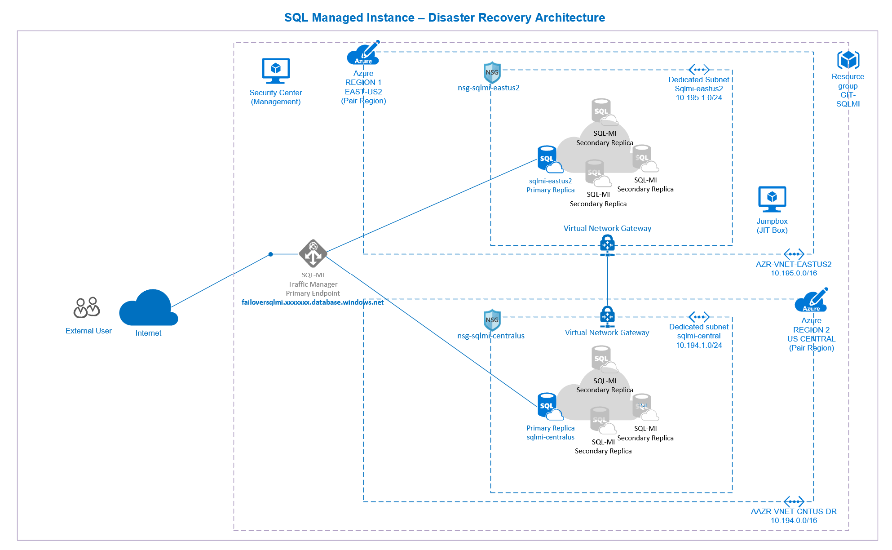

## E2E Architecture (visio)
The Visio version can be found [here](https://github.com/hcmarque/SQL-Managed-Instance-Disaster-Recovery-Architecture-Design/blob/master/Images/SQLMI-DR.vsdx)

## Requirements to have your Disaster Recovery Implementation working:
For the First Step, let’s create your Infrastructure, which include the following: 
* **Resource Groups (RG)** - We will create a dedicate RG for Network and another for SQL-MI; **Attention:** Both SQL Instances needs to be created on the same Resource Group, even located in different Regions;
* **Networks in 2 Azure Regions**: (EAST-US2 and CENTRAL-US in this design;
* **VPN Gateways between the Regions;** **Attention:** The virtual networks used by the the managed instances need to be connected through a VPN Gateway or Express Route. When two virtual networks connect through an on-premises network, ensure there is no firewall rule blocking ports 5022, and 11000-11999. Global VNet Peering is **not supported**.
* **Connections betweem the VPN Gateways;**
* Please find [here](https://docs.microsoft.com/en-us/azure/sql-database/sql-database-auto-failover-group#enabling-geo-replication-between-managed-instances-and-their-vnets) more details about the Network Requirements for SQL Managed Instances:  

## Step 1: Main Activity: Create two Resources Groups - SQL-MI and Network
* 1.1 - Create the Resource Group that will be used for both SQL Managed Instances (Primary and Secondary) –  Needs to be under the same Resource Group, otherwise your Failover Group wont work on later step). Click on `Create a Resource Group`

  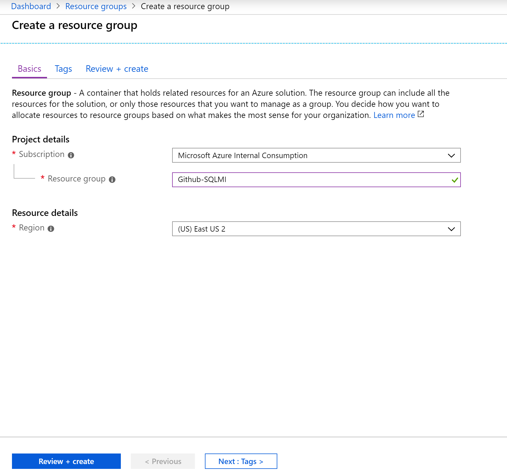

* 1.2 - Select the desired `Subscription`, `Resource group` name and `Region`. **Remember** In case of Disaster Recovery design, please consider the Pair regions considerations mentioned E2E Architecture considerations. In this Architecture Desing Example, we will consider EAST-US2 and CENTRAL-US for the Instances.
Now CLick on `Review + Create`.

  

* 1.3 - As soon as you have the Validation passed green light, click on `Create`

  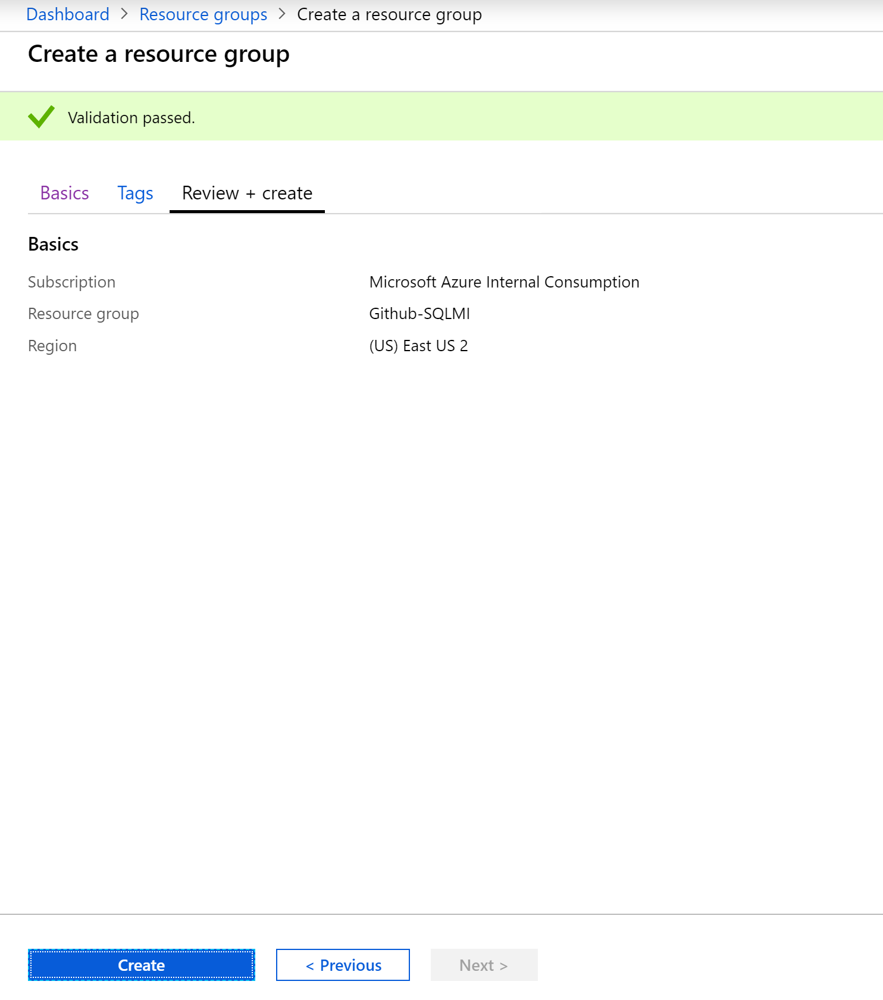

* 1.4 - Create the Resource Group that will be used for the Network Configurations. Click on `Create a Resource Group` and Select the desired `Subscription`, `Resource group` name and `Region`.
Now CLick on `Review + Create`.

  

* 1.5 - As soon as you have the Validation passed green light, click on `Create`

  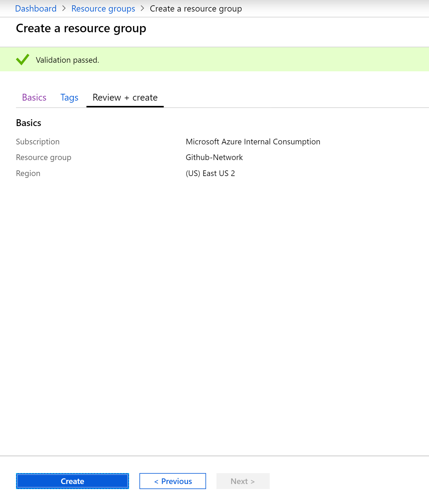

* 1.6 - Resource Group Summary for the SQL-Managed Instance Disaster Recovery Implementation:

  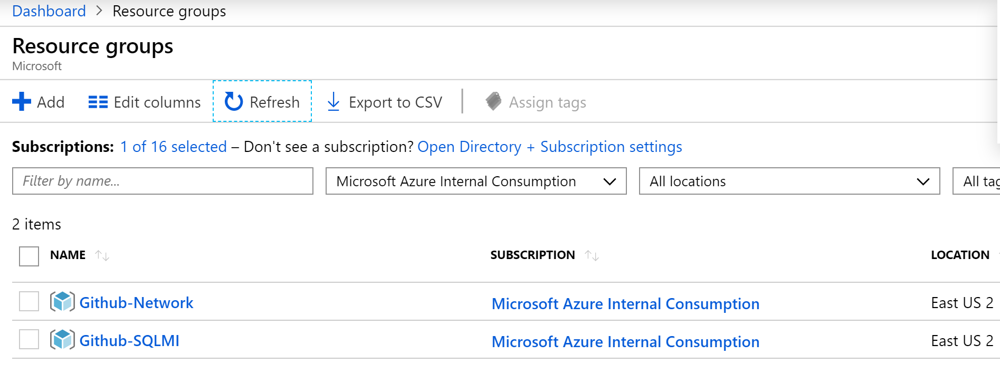

## Step 2: DDoS Standard Design

* 2.1 DDoS Standard
On the moment to create your network for the SQL-MI, is recommend to enable the DDoS Standard. 
Azure DDoS basic protection is integrated into the Azure platform by default and at no additional cost. 
Azure DDoS standard protection is a premium paid service that offers enhanced DDoS mitigation capabilities via adaptive tuning, attack notification, and telemetry to protect against the impacts of a DDoS attack for all protected resources within this virtual network.

Search for `DDoS protection plans` and then create a protection plan following the steps below:

  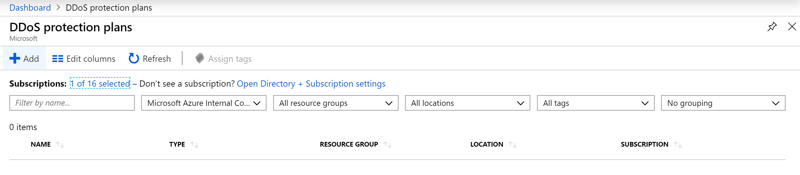

* 2.2 DDoS Parameters:
Create the DDoS Standard selecting the `Subscription`, `Resource Group` (The Network Resource Group that you just created on the previous step, Instance Details with the `Name` and `Region` Create the DDoS plan for booth Regions, in this step will be to CENTRAL-US. Click in `Review + Create` and then, `Create` after the Validation.

  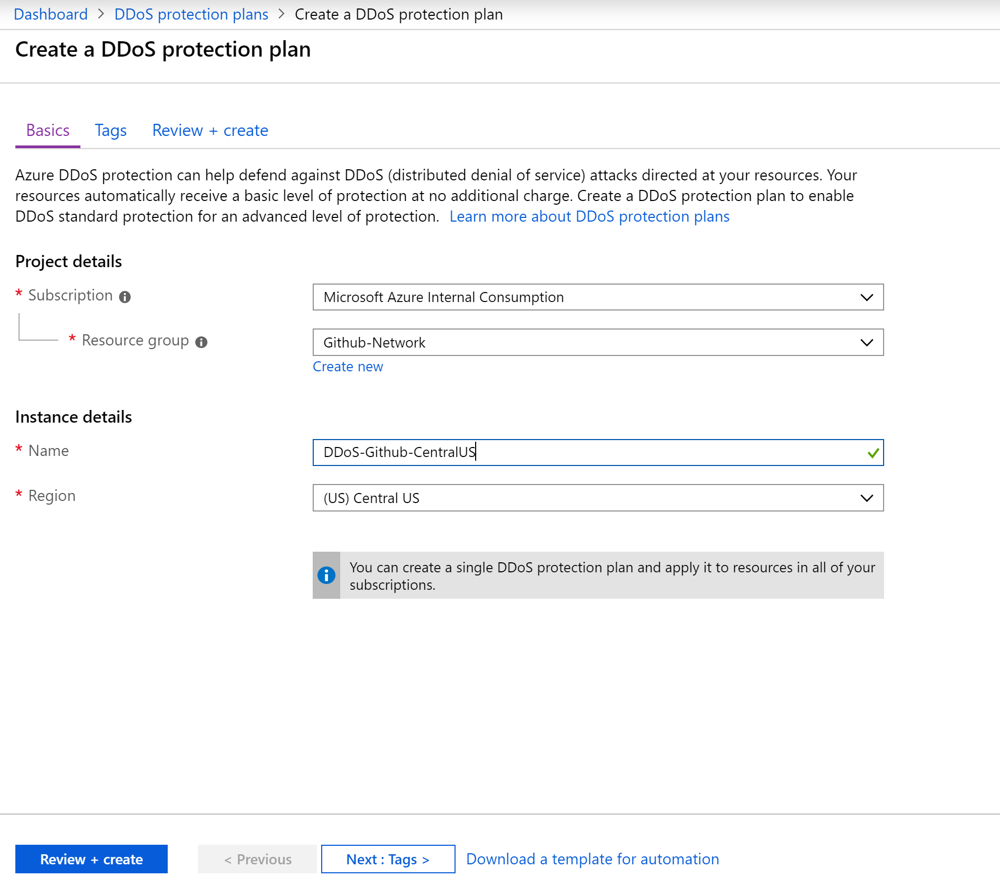

* 2.3 Create now for another region that you will launch your second instance: 

  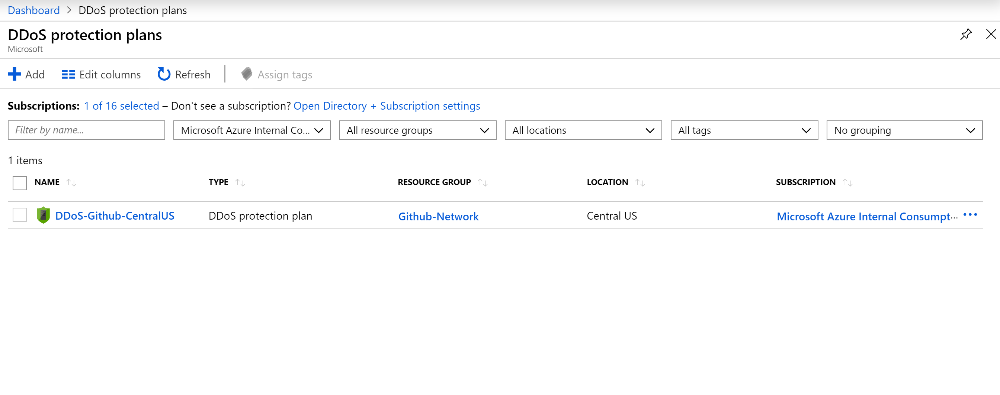

* 2.4 Create the DDoS Standard selecting the `Subscription`, `Resource Group` (The Network Resource Group that you just created on the previous step, Instance Details with the `Name` and `Region` Create the DDoS plan for booth Regions, in this step will be to EAST-US2. Click in `Review + Create` and then, `Create` after the Validation.

  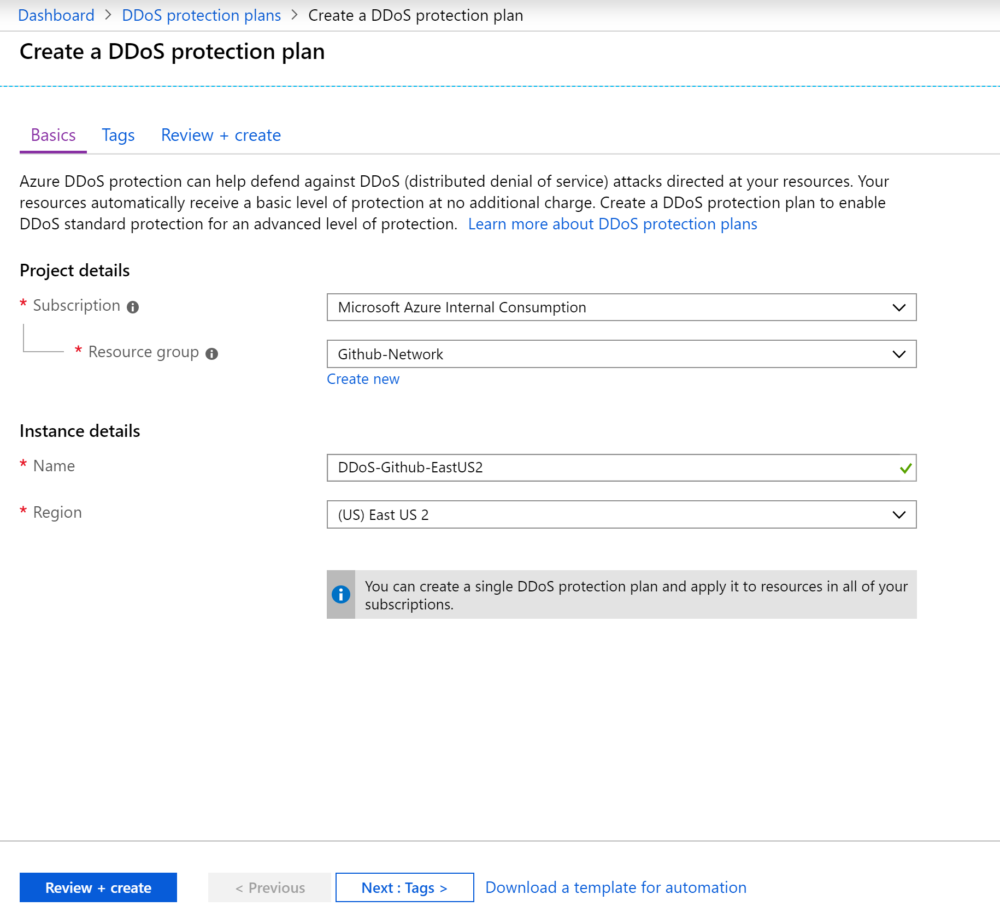

  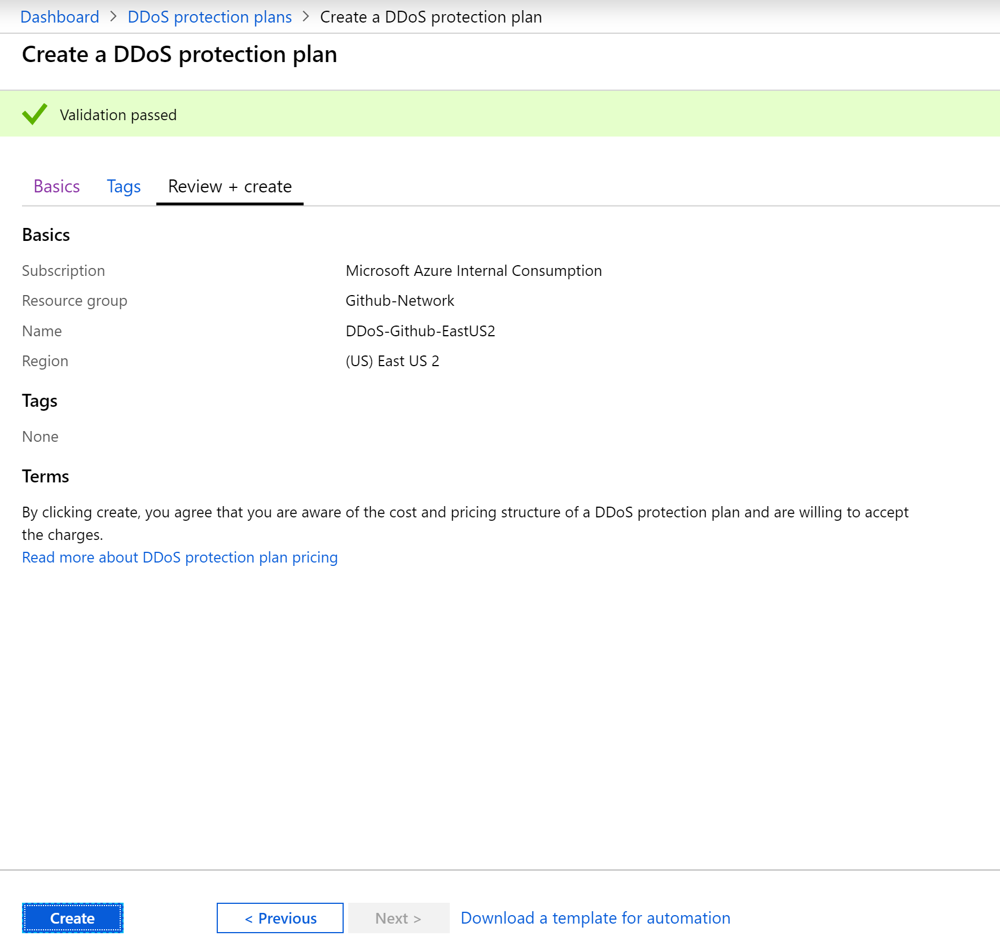

* 2.5 Back now to the Network Resource Group to see that the DDoS Protection Plan was created and is ready to be attached to a vnet that you will create now.

  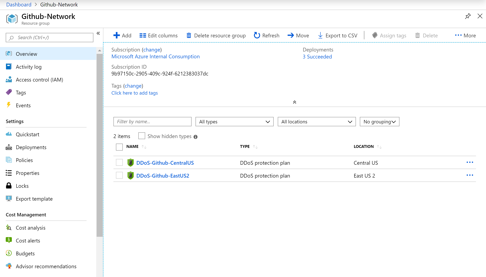

## Step 3: Create the Virtual Network on booth Regions

* 3.1 Inside of the MarketPlace, search for Virtual Netowork and create the Virtual Network clicking in `Create` as demonstrated on the picture below.

  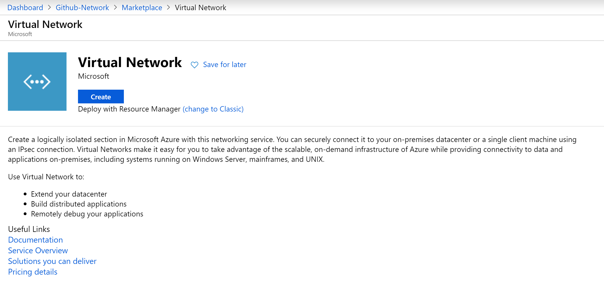

* 3.2 The following parameters will be used for this deployment. Use the names according with your Company/Department requirements. 
**Important: Use your own Ip Address Range, and be sure that you are not overlaying your On-Premise IP Address Range Network. The IP Address used in this example was used for this specif use case.**

  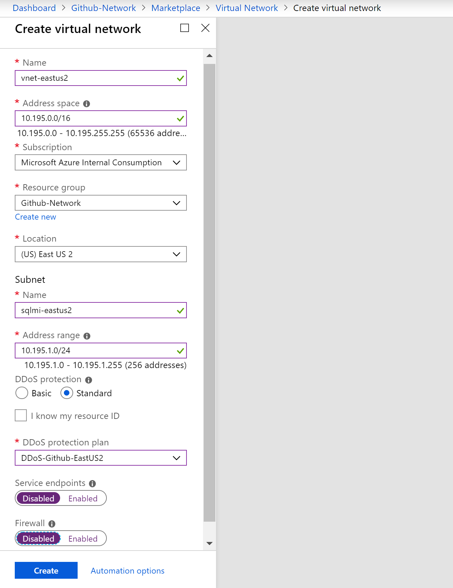

* 3.3 Back to your Github-Network Resource Group and `+ Add` a new Network

  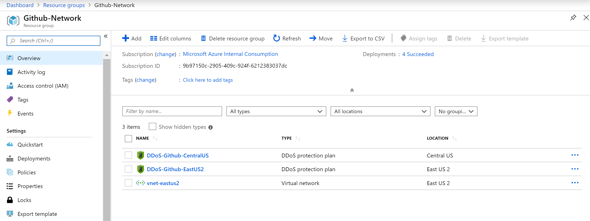

* 3.4 Configure now the new Virtual Network considering another region, in this scenario the Central US was used. The following parameters will be used for this deployment. Use the names according with your Company/Department requirements. 
**Important: Use your own Ip Address Range, and be sure that you are not overlaying your On-Premise IP Address Range Network. The IP Address used in this example was used for this specif use case.**

  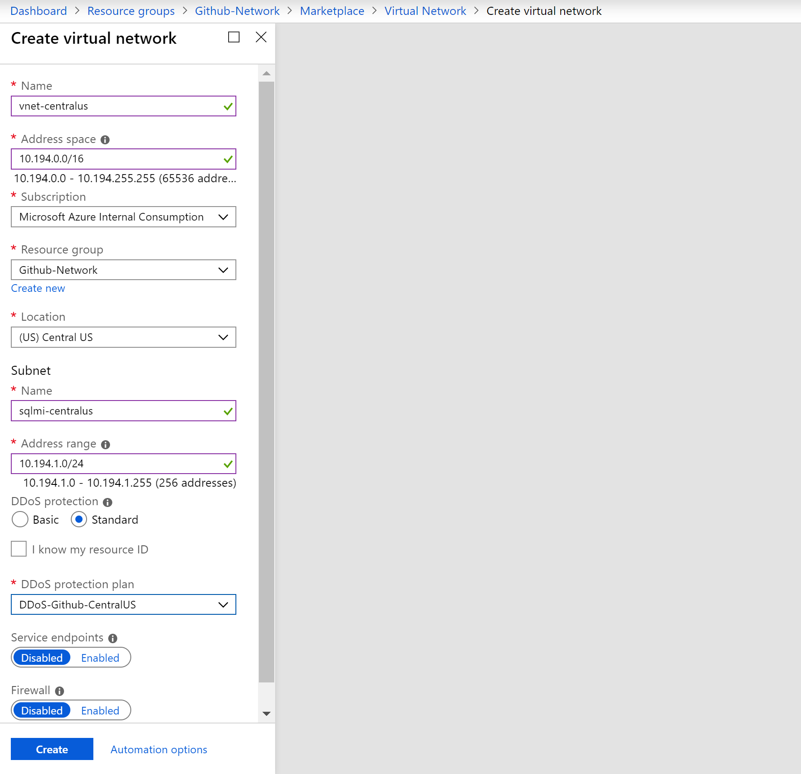

* 3.5 Check back to the Github-Network Resource Group that you have the following resources deployed at your environment. 

  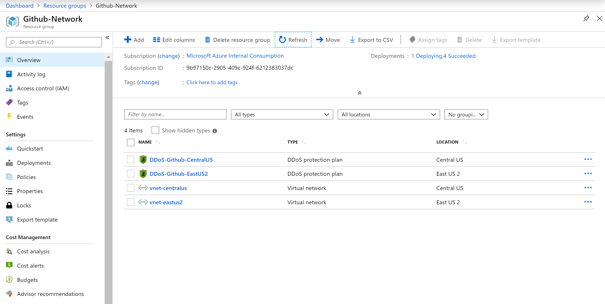

## Step 4: Create the Network Gateways to connect the booth Regions (In this scenario, EAST-US2 and CENTRAL-US)

Enabling geo-replication between managed instances and their VNets: (this reference can be found [here](https://docs.microsoft.com/en-us/azure/sql-database/sql-database-auto-failover-group#enabling-geo-rCreeplication-between-managed-instances-and-their-vnets)

When you set up a failover group between primary and secondary managed instances in two different regions, each instance is isolated using an independent virtual network. To allow replication traffic between these VNets ensure these prerequisites are met:
1.	The two managed instances need to be in different Azure regions.
2.	The two managed instances need to be the same service tier, and have the same storage size.
3.	Your secondary managed instance must be empty (no user databases).
4.	The virtual networks used by the the managed instances need to be connected through a VPN Gateway or Express Route. When two virtual networks connect through an on-premises network, ensure there is no firewall rule blocking ports 5022, and 11000-11999. Global VNet Peering is not supported.
5.	The two managed instance VNets cannot have overlapping IP addresses.
6.	You need to set up your Network Security Groups (NSG) such that ports 5022 and the range 11000~12000 are open inbound and outbound for connections from the other managed instanced subnet. This is to allow replication traffic between the instances
Important
Misconfigured NSG security rules leads to stuck database copy operations.
7.	The secondary instance is configured with the correct DNS zone ID. DNS zone is a property of a managed instance and its ID is included in the host name address. The zone ID is generated as a random string when the first managed instance is created in each VNet and the same ID is assigned to all other instances in the same subnet. Once assigned, the DNS zone cannot be modified. Managed instances included in the same failover group must share the DNS zone. You accomplish this by passing the primary instance's zone ID as the value of DnsZonePartner parameter when creating the secondary instance.

* 4.1 In order to do that, let’s go through the process and follow the step by step as you can see on the next process as follow. Search for `Virtual Network Gateway`

  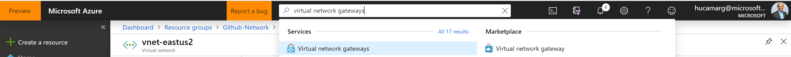

* 4.2 Click in `Create Virtual Network Gateway`

  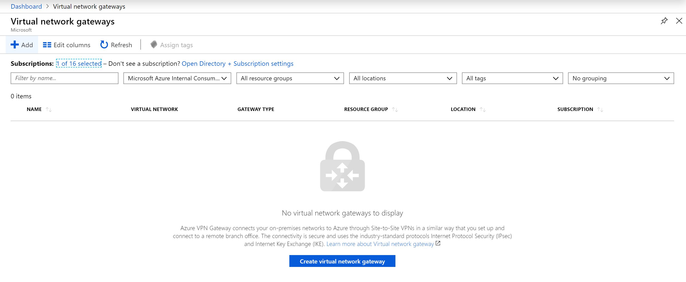

* 4.3 Check the informations used on the paramters described on the picture below. Please check this [table](https://docs.microsoft.com/en-us/azure/vpn-gateway/vpn-gateway-about-vpngateways#benchmark) to undertand which VPN Gateway SKU should be used in your enviroment. In this example, the VPN Gateway SKU VpnGw3AZ was used due the Aggregate Throughput requirement for 1.25 Gbps and the Zone-Redudant requirement. After complete the parameters, click in `Review + Create`
**important** please use the IP Address that you assigned to your environment.  **be sure that you dont have any IP Address with your on-premise networking.** `Click on Review + Create`.

  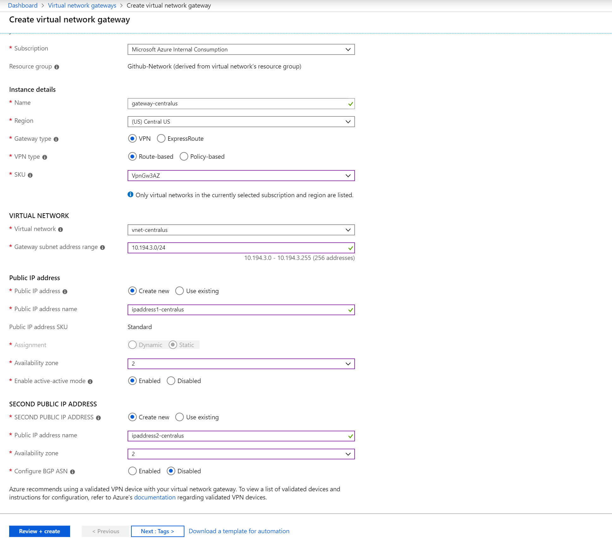

* 4.4 As soon as you have the Validation Passed, click in `Create`

  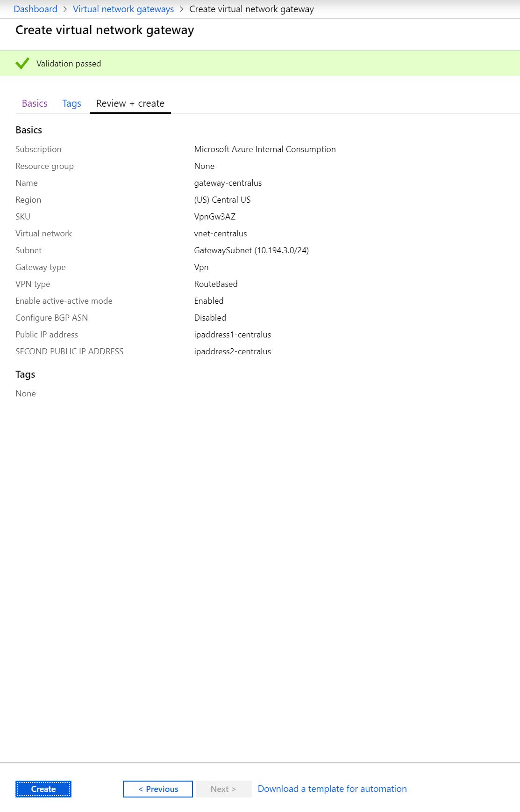

* 4.5 This process will take around 30 minutes to be completed, in meanwhile, let’s create the VPN GW for another region, EAST-US2 at this time. 
Back to the Virtual Network Page space and click `+ Add` to create the new VPN GW

  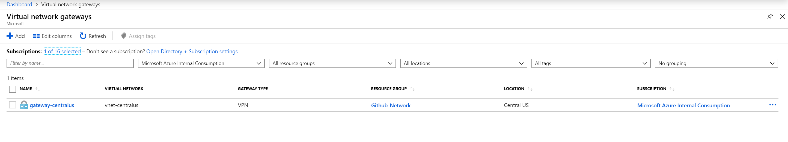

* 4.6 Check the informations used on the paramters described on the picture below. Please check this [table](https://docs.microsoft.com/en-us/azure/vpn-gateway/vpn-gateway-about-vpngateways#benchmark) to undertand which VPN Gateway SKU should be used in your enviroment. In this example, the VPN Gateway SKU VpnGw3AZ was used due the Aggregate Throughput requirement for 1.25 Gbps and the Zone-Redudant requirement. After complete the parameters, click in `Review + Create`
**important** please use the IP Address that you assigned to your environment.  **be sure that you dont have any IP Address with your on-premise networking.**

  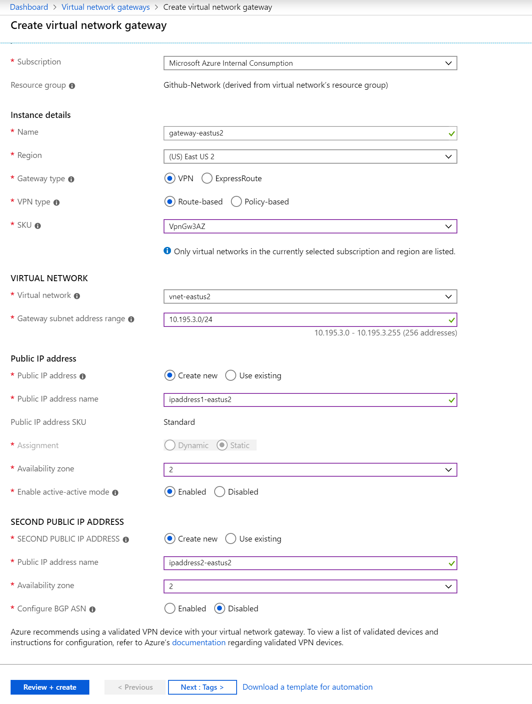

* 4.7 As soon as the validation passed, click in `Create`

  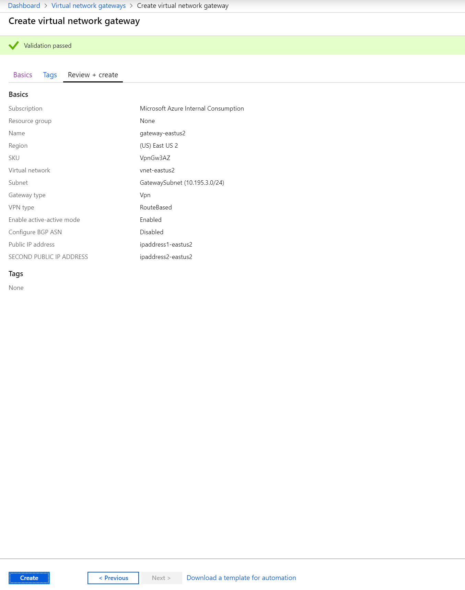

* 4.8 The process to create the VPN Gateway will take around 30 minutes to complete. 
As soon as booth VPN Gateways were created, back to the Github-Network Resource group (or the name that you used for the Network), select `gateway-centralus` and click on the `VPN Gateway Central`, click on `Connections` and `+ Add` in order to create a new connection between booth VPN GWs (CENTRAL-US and EAST-US2) that was just created on the steps above.

  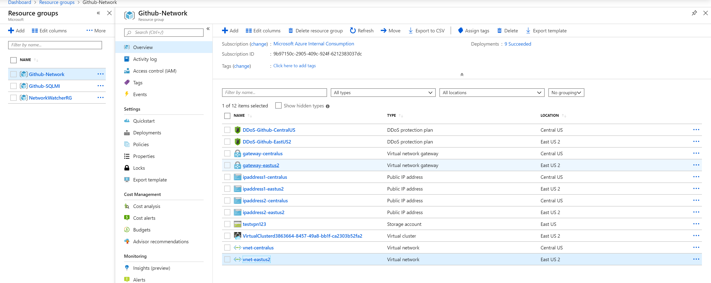

  

* 4.9 Add a connection now named `centralus-to-eastus2` with the followng parameters. Chose for the second virtual network gateway and select the vpn gateway available (that was just created). Fill all parameters and click `OK`

  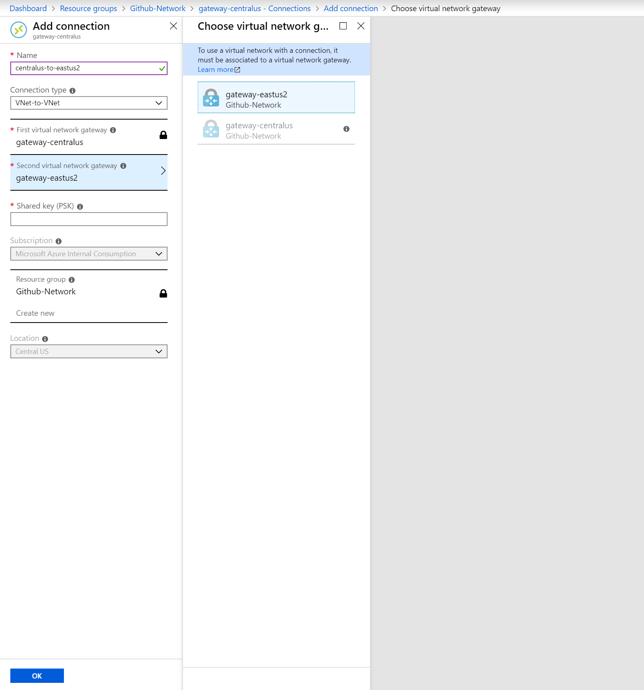

* 4.10 back to the Github-Network Resource group (or the name that you used for the Network), select `gateway-eastus2` and click on the `VPN Gateway Central`, click on `Connections` and `+ Add` in order to create a new connection between booth VPN GWs (CENTRAL-US and EAST-US2) that was just created on the steps above.

  

* 4.11 Add a connection now named `eastus2-to-centralus` with the followng parameters. Chose for the second virtual network gateway and select the vpn gateway available (that was just created). Fill all parameters and click `OK`

  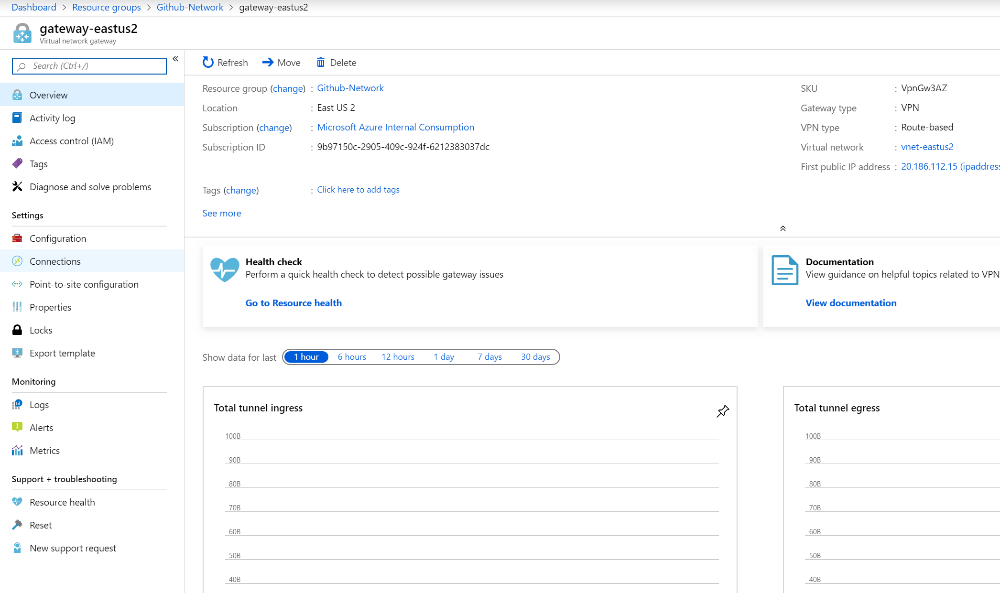

